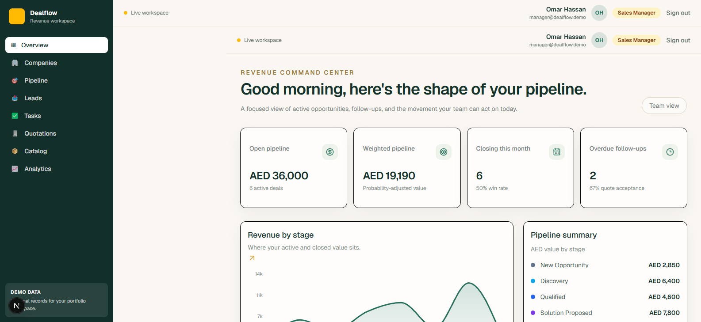
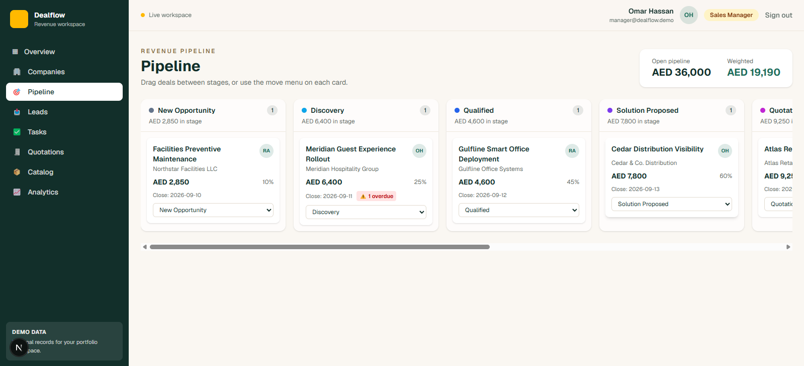
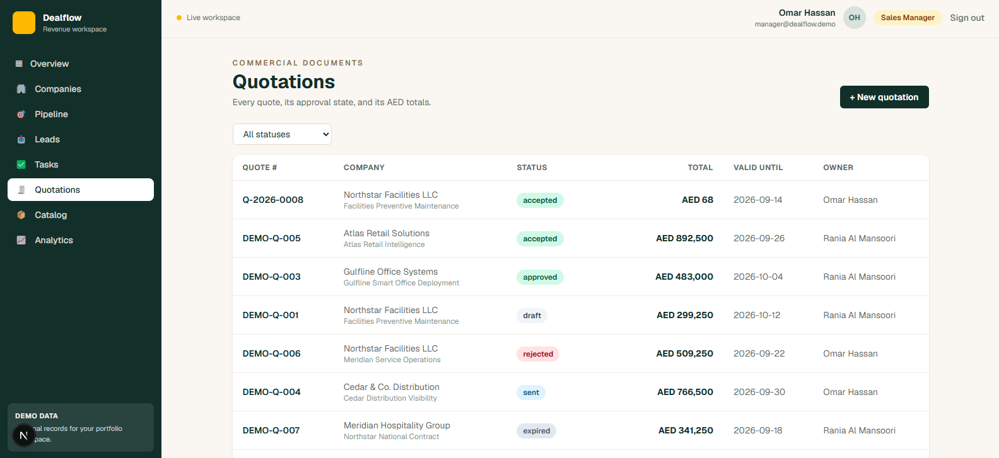
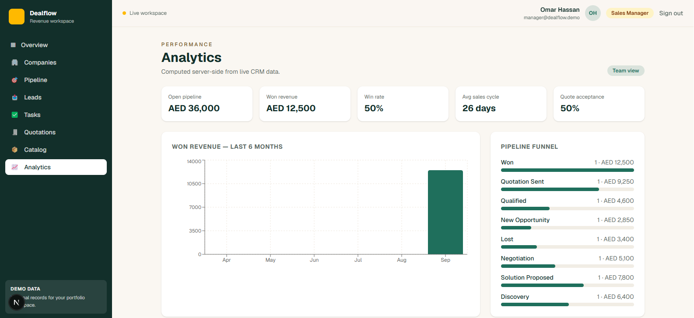

# Dealflow CRM — B2B Sales Revenue Workspace

A portfolio-grade B2B sales CRM for UAE-based teams: companies, contacts,
leads, a drag-and-drop pipeline, role-scoped tasks, an approval-driven
quotation engine with server-side AED math, and audited sensitive actions.

Built as a full product exercise: schema design, business rules enforced on
the server, role-based visibility, and a calm, dense UI — no generic admin
template look.

> All records are fictional demo data (seeded). Marked in-app as DEMO DATA.

## Demo accounts

| Role          | Email                 | Password   |
| ------------- | --------------------- | ---------- |
| Sales Rep     | rep@dealflow.demo     | Demo1234!  |
| Sales Manager | manager@dealflow.demo | Demo1234!  |
| Admin         | admin@dealflow.demo   | Demo1234!  |

Reps see only their own records; managers and admins see the whole team.
Every scope rule is enforced server-side (tRPC procedures), never in the UI.

## Screenshots

## Screenshots

| Dashboard | Pipeline board |
| --- | --- |
|  |  |

| Quotations | Team analytics |
| --- | --- |
|  |  |

## Feature highlights

- **Overview dashboard** — open/weighted pipeline, win rate, overdue
  follow-ups, revenue by stage, recent activity; personal-vs-team block for
  managers.
- **Company workspace** — profile, contacts (decision makers flagged),
  active deals, quotations, activity composer, open tasks.
- **Lead inbox** — scoring, sources, follow-up dates, and a conversion flow
  that reuses existing companies (no duplicates) and links the new deal.
- **Pipeline board** — drag-and-drop between stages with click/keyboard
  fallback; Won requires business fields; Lost requires a reason; closed
  deals are locked; every move writes an audit log entry.
- **Tasks & follow-up center** — overdue / today / upcoming buckets,
  priority indicators that do not rely on color alone.
- **Quotations** — builder with catalog price snapshots, server-side totals
  (subtotal − discount + 5% VAT), and an approval lifecycle:
  draft → pending_approval → approved → sent → accepted/rejected/expired.
  Reps submit; managers approve or reject with reason.
- **Catalog** — product price source of truth; price changes are audited.
- **Analytics** — win rate, average sales cycle, quote acceptance, per-owner
  performance, won-revenue trend; personal view for reps, team view for
  managers.

## Business rules enforced server-side

1. Role-based record visibility (rep vs manager/admin).
2. A deal cannot move to Won without expected close date and value > 0.
3. A deal cannot move to Lost without a lost reason.
4. Closed deals (Won/Lost) cannot change stage.
5. Quotation totals are always computed on the server; line items snapshot
   catalog prices at creation time.
6. Quotation approval and rejection-from-review require manager/admin.
7. Product price changes and quotation approvals/rejections write audit log
   entries with actor, before/after metadata, and timestamp.
8. Creator and timestamps are stored server-side and never trusted from
   the client.

## Tech stack

- [T3 Stack](https://create.t3.gg): Next.js (App Router), TypeScript, tRPC,
  Drizzle ORM, NextAuth (Credentials + JWT sessions)
- PostgreSQL on [Neon](https://neon.tech) (serverless)
- Tailwind CSS + shadcn/ui primitives, Recharts
- Zod validation end-to-end

## Getting started

Prerequisites: Node 20+, a Neon (or any) PostgreSQL database.

```bash
git clone <your-repo-url>
cd dealflow
npm install

# environment
cp .env.example .env
# set DATABASE_URL and AUTH_SECRET in .env

npm run db:push     # create schema
npm run seed        # fictional demo data (idempotent)
npm run dev         # http://localhost:3000